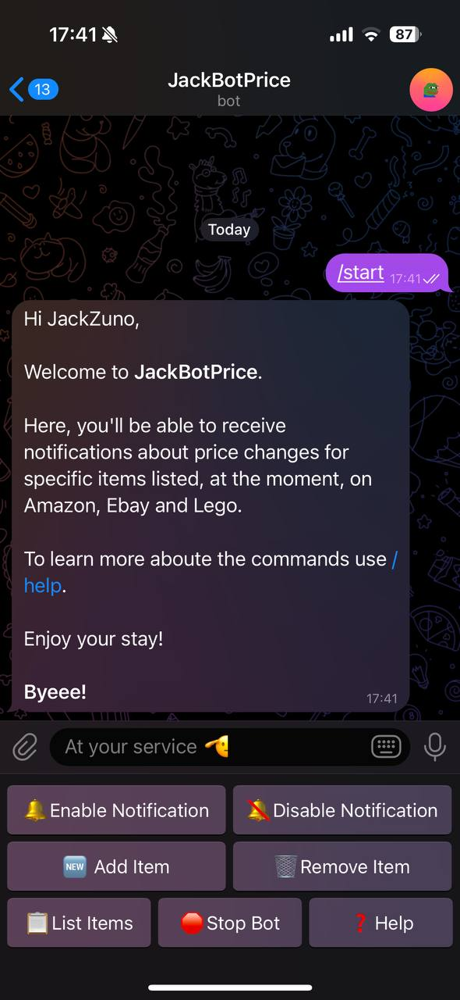
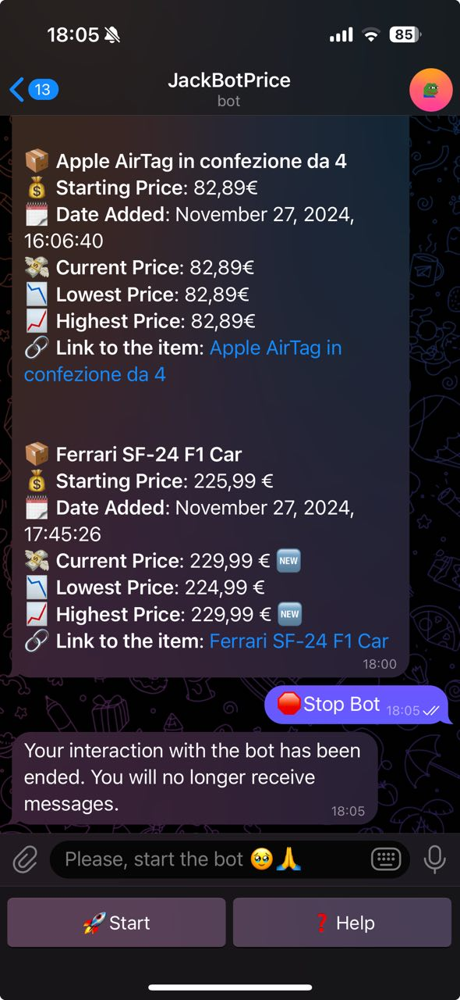
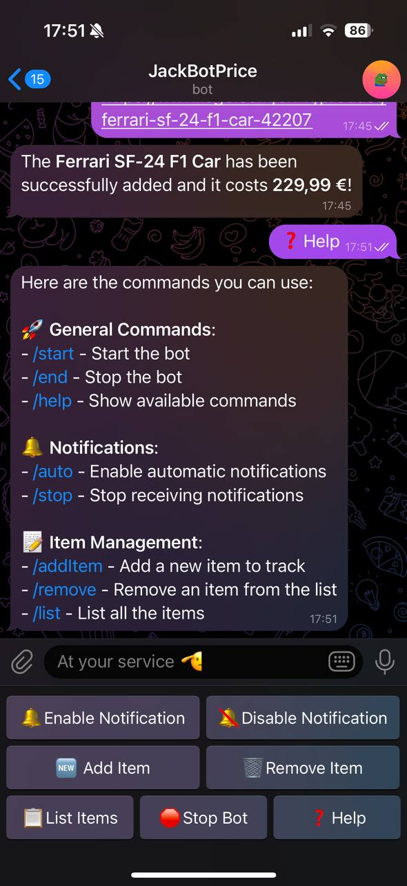
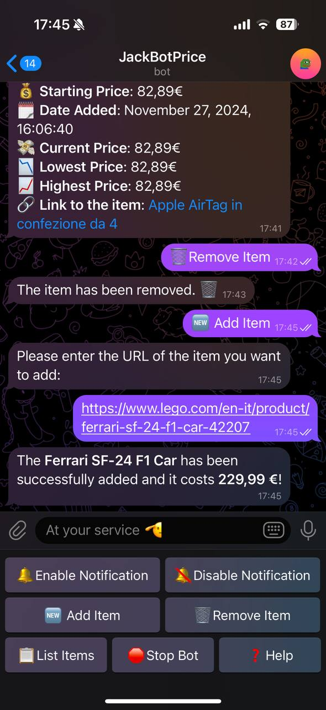
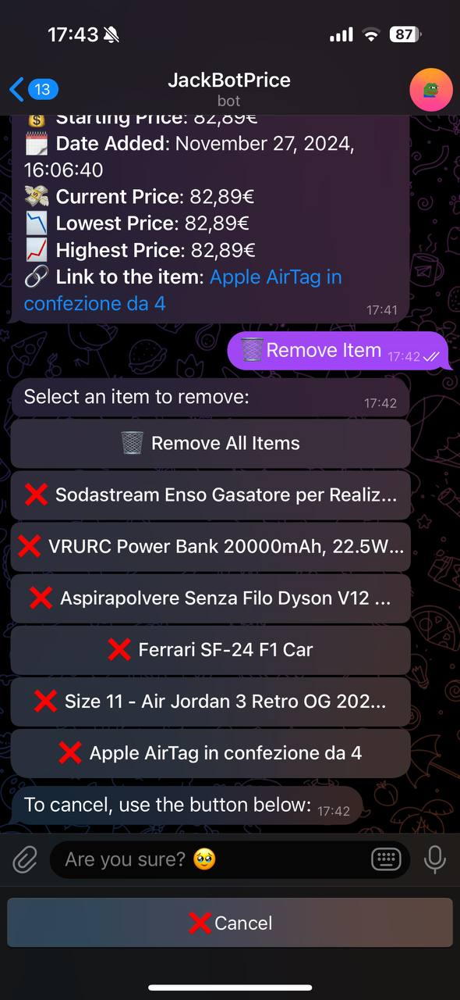
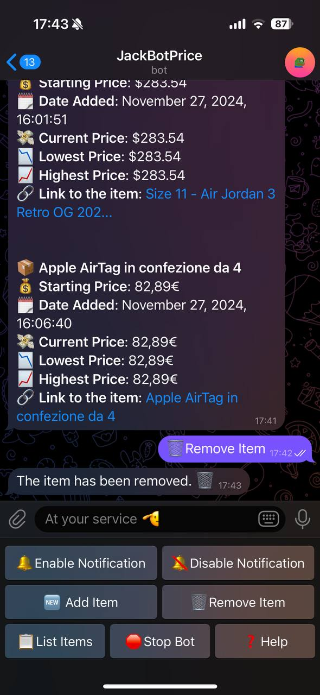
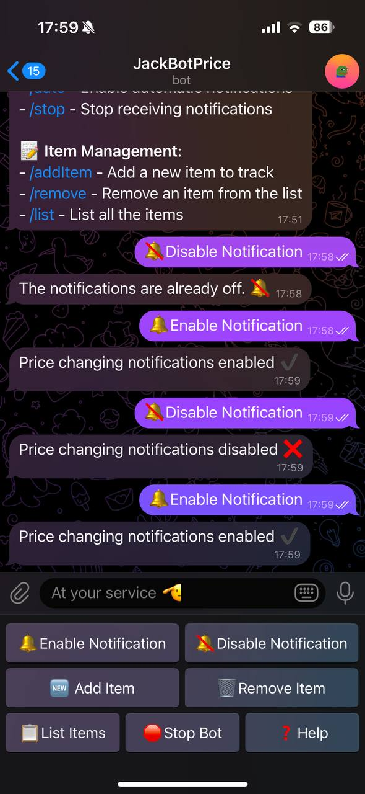
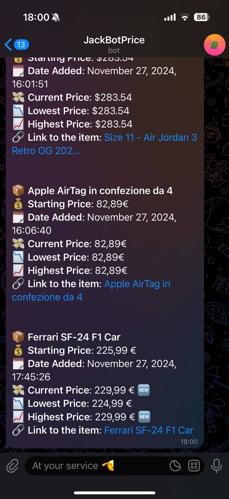
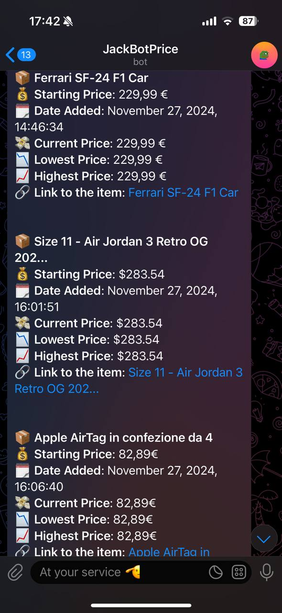

# Price Tracker Bot

## Content
The **Price Tracker Bot** is a Telegram bot designed to track price fluctuations of specific items. Users can start the bot with the command **/start** (["start example"](#start-image)). He can add items to the bot's watchlist using the **/add** command (["add example"](#add-image)), where the only required parameter is the item's URL. Currently, the bot supports online stores such as Amazon (tested with Amazon IT and UK), eBay (tested with eBay IT, UK, and USA), and the Lego Store.

Once items are added, they can be listed using the **/list** command (["list example"](#list-image)). This command will display key details for each item, including its *name*, *initial price* at the time of addition, *date* of addition, and the *current price*. It will also show the *lowest* and *highest price* recorded, along with a clickable URL that directs to the product page.

Users can remove individual items or clear all items from their list through a specific button (or the **remove all** or the **remove item_name**). If the user want to cancel the operation, the bot provide a **cancel** button for easy exit (["remove example"](#remove-pt1-image)). After an item is removed, the bot will delete any prior messages related to that item and notify the user whether the deletion was successful (["remove done example"](#remove-pt2-image)).

The bot also offers the option to **enable or disable notifications** (["enable/disable example"](#enable-image)). When notifications are enabled, the bot sends updates twice a day, one time in the morning (9:00 UTC) and one time in the evening (21:00 UTC). These notifications include the same information as the **/list** command, but the bot will first check for any price changes and update the current price accordingly (["message example"](#msg-image)). If there are any changes in price, a new emoji is added to indicate the specific update. If the bot is restarted, users with notifications enabled will be alerted. To ensure they don't miss any price updates, they should disable (**/stop**) and then re-enable (**/auto**) notifications.

If a user decides to disable notifications, the bot will stop sending updates about price changes. Additionally, if there are no items in the list, the bot will suggest disabling notifications.

If a user blocks the bot without first issuing the **/end** command (["stop bot example"](#stop-image)), the bot will automatically stop sending messages after the first notification is sent following the block. The bot detects this situation through an exception triggered after a scheduled message fails to send due to the block from the user.

Finally, the **/help** command provides a list of all available commands in the bot (["help example"](#help-image)).

## Usage Example

The first image is showing the **start** command of the bot.\
The second image is showing the **stop** command of the bot.\
The third image is showing the **help** command of the bot.

    
    
    

The first image is showing the **add item** command of the bot.\
The second image is showing the **remove item** command of the bot.\
The third image is showing the result of the **remove item** command of the bot.

    
    
    

The first image is showing the **enable/disable notification** command of the bot.\
The second image is showing the **notification message** of the bot.\
The third image is showing the result of the **list** command of the bot.

    
    
    

<!-- 

  
  
  

  
  
  

  
  
  

 -->
